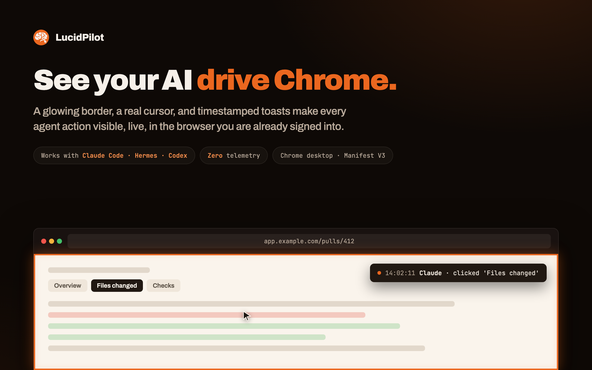
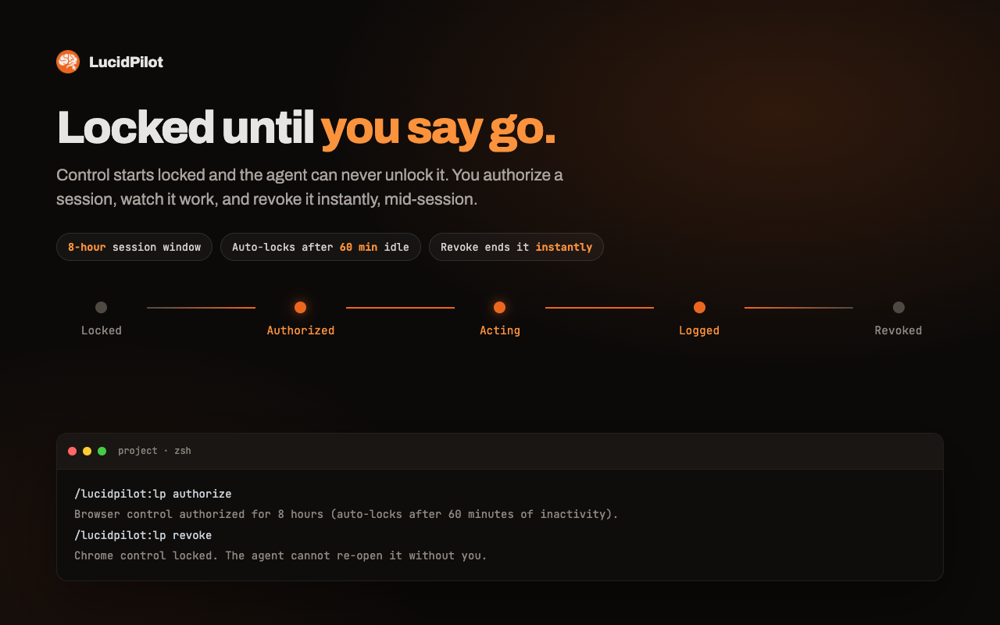
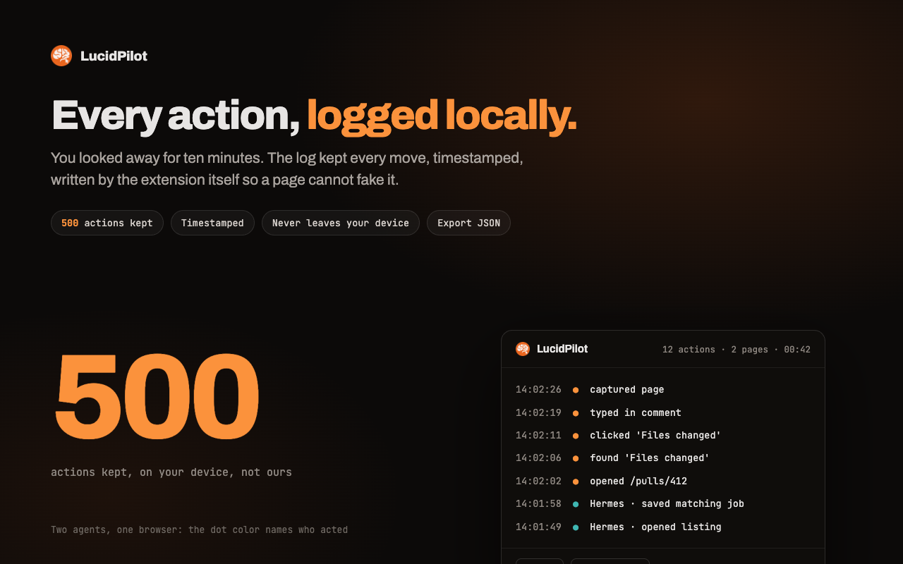

<p align="center">
  
</p>

<h1 align="center">LucidPilot</h1>

<p align="center">
  <b>See what your AI agent is doing in your browser - and, when you want, let it drive.</b>
</p>

<p align="center">
  <a href="https://pilot.lucidfabrics.com">Website</a> ·
  <a href="#quickstart">Quickstart</a> ·
  <a href="#the-safety-model">Safety model</a> ·
  <a href="https://pilot.lucidfabrics.com/privacy">Privacy</a>
</p>

<p align="center">
  
  
  
  
</p>



Claude Code and Hermes can already browse for you. LucidPilot makes that
visible and keeps it under your control:

- **You see everything.** A glowing border marks the driven tab, a real cursor
  glides to every target, and a timestamped toast names each action as it lands.
- **You stay in charge.** Browser control starts locked. The agent can never
  unlock it. Activating your licence is the consent moment, and one command
  (`/lp revoke`) locks it again mid-flight.
- **You can prove it.** A local audit log keeps the last 500 actions,
  written by the extension itself, so a web page cannot fake the record.

It drives the Chrome profile you are already signed into, over the Chrome
DevTools Protocol. Not a headless copy, no separate browser.

## Quickstart

Three steps. Each one tells you what success looks like.

### 1. Install the Chrome extension

Install from the
[Chrome Web Store](https://chromewebstore.google.com/detail/bfebfknclgjglelmlocldhnjkpngelfl)
(listing in review - it goes live at that link the moment Google approves it).

> **You'll know it worked** when a new LucidPilot icon appears in your toolbar.
> Click it any time for the session log, the test-drive demo, and health checks.

The extension installs free and does nothing until a licence is activated -
neither the overlay nor the tools. Licences are $2.99/mo or $19.99/yr at
[pilot.lucidfabrics.com](https://pilot.lucidfabrics.com), 3 devices each,
14-day refund, no questions asked. Your key arrives by email; paste it into
the extension popup.

### 2. Connect your agent

**Claude Code:**

```
/plugin marketplace add lucid-fabrics/lucidpilot
/plugin install lucidpilot@lucidpilot
```

**Or Hermes:**

```
hermes plugins install https://github.com/lucid-fabrics/lucidpilot.git
hermes gateway restart
```

Requires `python3` on PATH and nothing else - no pip packages.

Both commands install straight from
[GitHub releases](https://github.com/lucid-fabrics/lucidpilot/releases) -
each tag publishes the two plugin zips plus `SHA256SUMS` there for an offline
or air-gapped install. That repo ships the plugins only: the Chrome extension
itself is Chrome-Web-Store-only, never bundled into a plugin download.

> **You'll know it worked** when you restart your agent and `/lp status`
> (Claude Code namespaces it as `/lucidpilot:lp`, autocomplete finds it from
> `/lp`) reports the extension connected.

Approve the `lucidpilot_command` permission prompt when it appears. In
1.2.0 licence activation is the consent moment - there is nothing to
authorize. The `my_browser_authorize` tool still exists for one job:
`/lp revoke` routes through it to lock Chrome control manually, so you
will only ever see its permission prompt on an explicit revoke.

### 3. Drive the browser



In 1.2.0 there is no `/lp authorize` step. Activating your licence key in
the extension popup is the consent moment for browser control: the bridge
auto-grants Chrome control the moment a valid licence is asserted, and
keeps it alive while you use it. `/lp status` shows the state in one line.

```
/lp revoke               # lock the tools instantly, mid-session
```

> **You'll know it worked** when your agent's next browser action paints a
> glowing border around the tab and a toast names the move.

If you'd rather skip the licence paste entirely, an auto-grant env var
unlocks every new bridge the moment it starts (and reads the licence
server-side, so the licence itself is still the gate):

```
LUCIDPILOT_AUTO_AUTHORIZE=1          # every new session starts authorized; licence gates the tools
LUCIDPILOT_AUTO_AUTHORIZE=indefinite # no clocks at all, only /lp revoke ends it
```

Setting the env var IS the human consent (same power-user opt-out as
`indefinite`); the agent still cannot grant itself anything. The auto-grant is
an ordinary grant - hard cap and idle lock still apply unless `indefinite` -
and it never extends a window that is already running.

### Making LucidPilot the default browser tool

Once licensed, LucidPilot steps in front of rival browser tools
(claude-in-chrome, chrome-devtools, hermes-chrome-plugin's chrome_*) so your
agent drives your real Chrome instead of a separate, signed-out one. This is
on by default. To turn it off:

```
/lp default off  # leave rival browser tools alone
/lp default on   # back to redirecting them to my_browser_*
```

## What you get

One licence unlocks everything - both halves, both integrations.

| The overlay | The control engine |
|---|---|
| Glowing border on the driven tab | 21 `my_browser_*` tools over CDP |
| A real cursor that glides, then marks what it hit | Click, type, fill, scroll, drag, upload |
| Action toasts, color-coded per agent | Navigate, wait, launch |
| Local session log: 500 actions, timestamped | Snapshot, screenshot, find, inspect |
| Red alert border on flagged sensitive domains | Console and network inspection |



The log never records what was typed, only that typing happened. It never
leaves your device: no analytics, no telemetry. The only network calls are
checkout and a daily licence check
([privacy policy](https://pilot.lucidfabrics.com/privacy)).

## The safety model

- **Locked until a human says otherwise.** Licence activation is the consent
  moment (control auto-locks after 60 minutes idle) and the agent can never
  unlock itself.
- **One command ends it.** `/lp revoke` locks the tools instantly, mid-session.
- **The log is written by the extension.** A page can fake the overlay. It
  cannot fake the log.
- **A submit/buy/pay click pauses for you first.** Clicking something that
  resolves to a submit button, or a label like "Buy Now", "Place Order",
  "Pay Now", or "Checkout", shows an on-page approve/deny prompt before the
  click fires - not just an overlay you watch, one that can stop the click.
  It also activates the tab and raises a macOS notification with its own
  Approve/Deny buttons, so you don't have to be looking at the browser to
  catch it. It denies by default: click Deny, don't answer, or let it sit
  for 3 minutes, and nothing happens - the agent gets back a
  `confirm-denied` or `confirm-timeout` error, never a silent failure.

### What it does not do

The parts a demo will not tell you:

- The overlay itself cannot stop an agent - it's a window, not a lock. The
  submit/buy/pay pause above is the one real exception, and only when the
  agent resolved a specific element (a selector or a snapshot uid); a bare
  coordinate click skips it.
- Sensitive domains (popup's "Sensitive sites" panel) only turn the overlay
  red as a warning - they do not block anything, same ALARM ONLY caveat as
  the overlay itself.
- Chrome on the desktop only. No Edge, no Brave, no mobile.
- It drives the browser you are signed into. That is the point, and the risk.

<details>
<summary><b>Coexistence with hermes-chrome-plugin</b></summary>

LucidPilot is a fork-and-rename of hermes-chrome-plugin's connector, built to
run side by side with an existing hermes-chrome-plugin install on the same
machine, not replace it:

| | hermes-chrome-plugin | LucidPilot |
|---|---|---|
| Bridge port | 16319 | 16329 (`LUCIDPILOT_BRIDGE_PORT`) |
| Tool prefix | `chrome_*` | `my_browser_*` |
| Slash command | `/chrome` | `/lp` |
| Extension | its own, separate id | its own, separate id (pinned via manifest key) |

If both plugins are installed, the `control_tools` config knob decides
whether `my_browser_*` registers at all:

```yaml
# ~/.hermes/config.yaml
lucidpilot:
  control_tools: auto   # auto (default) | always | never
```

(or `LUCIDPILOT_CONTROL_TOOLS=auto|always|never`, env wins over config).
`auto` skips registering `my_browser_*` and `/lp` when hermes-chrome-plugin
looks installed, so one session doesn't end up with two near-identical sets
of browser-control tools. `indicator_*` always registers regardless, it's
cosmetic and has nothing to double up on.

With `always`, both tool sets register at once. When that happens, LucidPilot
denies `chrome_*` calls in favor of `my_browser_*` under the same conditions
as the "default browser tool" behavior above (licensed, authorized,
connected) - `/lp default off` turns it off here too.

</details>

<details>
<summary><b>How it's put together</b></summary>

The Chrome extension itself (MV3: overlay content script, session log popup,
and the connector that polls the bridge) ships through the Chrome Web Store;
this repo holds the two agent plugins that drive it:

```
bridge.py            loopback HTTP server on 127.0.0.1:16329, queues/delivers
                     commands between a Hermes/Claude Code session and the
                     extension's service worker
auth.py               Chrome-control gate: auto-grants on licence activation, /lp revoke locks
                     grants a time-boxed (or indefinite) window
licensing.py          Pro license gate: reads the verdict the extension
                     asserts to the bridge
chrome_tools.py       the 21 my_browser_* tool handlers (gated on auth + license)
indicator_tools.py    the 6 indicator_* tools (cosmetic, licence-gated)
commands.py           the /lp slash command
mcp_server.py         MCP stdio server: the same tools + /lp for Claude Code
redirect_policy.py    shared policy: which rival tools redirect to
                     my_browser_*, and the /lp default on|off preference
pretooluse_hook.py    Claude Code's PreToolUse hook entry point (Claude Code only)
plugin.yaml, __init__.py   Hermes plugin entry point (repo root)
```

The extension talks to `bridge.py` the same way hermes-chrome-plugin's own
extension talks to its own bridge: long-poll `/next` for a queued command,
`POST /result` to answer it. `GET /status` folds in auth and license state so
the popup's health panel and `/lp doctor` read one source of truth.

Licence keys live only in the extension popup, which re-checks online about
once a day; `bridge.py` verifies the server-signed session token the
extension forwards, so a tampered extension cannot vouch for itself. The
licence check is stdlib-only (`ed25519_verify.py`) - no pip packages.

</details>

<details>
<summary><b>Running the plugin tests</b></summary>

```bash
python3 -m pytest tests/python/
```

</details>

## Licence

The code in this repo is [MIT](LICENSE). The product is licence-gated at
runtime: the extension and tools activate with a key from
[pilot.lucidfabrics.com](https://pilot.lucidfabrics.com). One activation
covers both Claude Code and Hermes on up to 3 devices, with a 14-day
no-questions refund.

Built by [Lucid Fabrics](https://pilot.lucidfabrics.com). Support:
[support@lucidfabrics.com](mailto:support@lucidfabrics.com).
